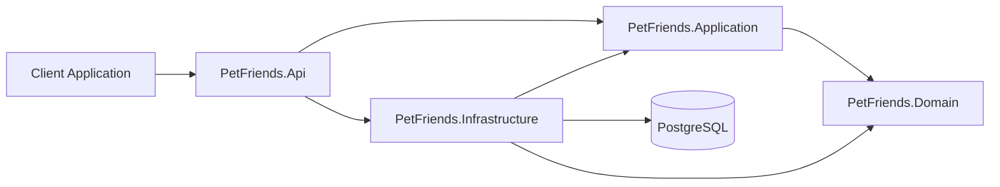

# PetFriends

[](https://github.com/JoaoFranco1998/PetFriends/actions/workflows/ci.yml)

PetFriends is a platform for reporting lost, found and sighted animals, helping pet owners and communities share relevant information and resolve cases more efficiently.

The project is being developed as a professional portfolio project using C#, ASP.NET Core, PostgreSQL, Docker and software-engineering practices such as requirements traceability, Scrum, Pull Requests and continuous integration.

## Problem

When someone loses or finds an animal, it is often unclear:

* where the case should be published;
* which organizations should be contacted;
* how the animal can be identified;
* how personal contact information can be shared safely;
* whether there are related lost or found reports nearby.

Information is usually spread across social networks, messaging groups, veterinary clinics, shelters and municipal services.

PetFriends aims to provide a structured and centralized workflow for these situations.

## MVP

The first usable version of PetFriends will support:

* user registration and authentication;
* lost animal reports;
* found animal reports;
* animal sighting reports;
* animal characteristics and occurrence information;
* approximate location data;
* report photos;
* paginated search and filtering;
* report ownership and authorization;
* report resolution and archiving;
* basic moderation;
* privacy-aware contact information.

The following capabilities are planned for later phases:

* location-based notifications;
* automatic lost/found matching;
* institution profiles;
* adoption listings and applications;
* foster-family registration;
* volunteer opportunities;
* donations.

## Technology stack

| Area                 | Technology            |
| -------------------- | --------------------- |
| Language             | C#                    |
| Runtime              | .NET 10               |
| API                  | ASP.NET Core Web API  |
| Database             | PostgreSQL 18         |
| ORM                  | Entity Framework Core |
| PostgreSQL provider  | Npgsql                |
| Local infrastructure | Docker Compose        |
| Testing              | xUnit                 |
| API documentation    | OpenAPI               |
| CI                   | GitHub Actions        |
| Project management   | Jira                  |
| Version control      | Git and GitHub        |

## Architecture

PetFriends follows a layered architecture inspired by Clean Architecture.



### Projects

```text
src/
├── PetFriends.Api
├── PetFriends.Application
├── PetFriends.Domain
└── PetFriends.Infrastructure

tests/
├── PetFriends.UnitTests
└── PetFriends.IntegrationTests
```

### Responsibilities

#### PetFriends.Api

Responsible for:

* HTTP endpoints;
* controllers;
* middleware;
* authentication configuration;
* OpenAPI configuration;
* dependency-injection composition;
* HTTP request and response handling.

#### PetFriends.Application

Responsible for:

* use cases;
* commands and queries;
* DTOs;
* application validation;
* interfaces for infrastructure services;
* application orchestration.

#### PetFriends.Domain

Responsible for:

* entities;
* value objects;
* domain enums;
* business rules;
* domain exceptions;
* domain behaviour.

The Domain project must remain independent of ASP.NET Core, Entity Framework Core and external services.

#### PetFriends.Infrastructure

Responsible for:

* Entity Framework Core;
* PostgreSQL integration;
* database context;
* entity configurations;
* migrations;
* repositories;
* external service implementations;
* media storage implementations.

## Prerequisites

Install the following tools:

* .NET 10 SDK;
* Git;
* Docker Desktop;
* Visual Studio 2026 or another compatible development environment;
* pgAdmin 4, optional.

Confirm the installations:

```powershell
dotnet --version
git --version
docker --version
docker compose version
```

## Local setup

### 1. Clone the repository

```powershell
git clone https://github.com/JoaoFranco1998/PetFriends.git
cd PetFriends
```

### 2. Restore local .NET tools

```powershell
dotnet tool restore
```

### 3. Create the Docker environment file

On PowerShell:

```powershell
Copy-Item .env.example .env
```

On Bash:

```bash
cp .env.example .env
```

Open `.env` and configure a local PostgreSQL password:

```env
POSTGRES_DB=petfriends
POSTGRES_USER=petfriends_app
POSTGRES_PASSWORD=REPLACE_WITH_A_LOCAL_PASSWORD
POSTGRES_PORT=5432
```

The `.env` file is ignored by Git and must never be committed.

### 4. Configure the API connection string

Store the connection string using .NET User Secrets:

```powershell
dotnet user-secrets set `
  "ConnectionStrings:PostgreSQL" `
  "Host=localhost;Port=5432;Database=petfriends;Username=petfriends_app;Password=REPLACE_WITH_A_LOCAL_PASSWORD" `
  --project src/PetFriends.Api/PetFriends.Api.csproj
```

The password must match the value configured in `.env`.

### 5. Start PostgreSQL

```powershell
docker compose up -d
```

Confirm that the database is healthy:

```powershell
docker compose ps
```

Expected service:

```text
petfriends-postgres   Up   healthy
```

### 6. Restore and build the solution

```powershell
dotnet restore
dotnet build
```

### 7. Run the tests

```powershell
dotnet test
```

### 8. Run the API

```powershell
dotnet run --project src/PetFriends.Api/PetFriends.Api.csproj
```

The local API address is displayed in the terminal when the application starts.

## Database commands

Create a migration:

```powershell
dotnet ef migrations add MigrationName `
  --project src/PetFriends.Infrastructure/PetFriends.Infrastructure.csproj `
  --startup-project src/PetFriends.Api/PetFriends.Api.csproj
```

Apply migrations:

```powershell
dotnet ef database update `
  --project src/PetFriends.Infrastructure/PetFriends.Infrastructure.csproj `
  --startup-project src/PetFriends.Api/PetFriends.Api.csproj
```

Display the current Entity Framework Core context:

```powershell
dotnet ef dbcontext info `
  --project src/PetFriends.Infrastructure/PetFriends.Infrastructure.csproj `
  --startup-project src/PetFriends.Api/PetFriends.Api.csproj
```

## Docker commands

Start the services:

```powershell
docker compose up -d
```

View their status:

```powershell
docker compose ps
```

View PostgreSQL logs:

```powershell
docker compose logs postgres
```

Stop and remove the containers:

```powershell
docker compose down
```

Remove the containers and local database volume:

```powershell
docker compose down -v
```

The last command permanently removes the local PostgreSQL data.

## Continuous integration

The GitHub Actions CI workflow runs automatically:

* when a Pull Request targets `main`;
* when code is pushed to `main`;
* when manually triggered from GitHub Actions.

The workflow performs:

1. repository checkout;
2. .NET SDK setup;
3. dependency restoration;
4. Release build;
5. automated test execution.

Pull Requests must pass CI before being merged.

## Development workflow

PetFriends uses GitHub Flow.

```text
Jira work item
      ↓
Create branch from main
      ↓
Implement and test
      ↓
Open Pull Request
      ↓
CI validation and review
      ↓
Squash merge into main
      ↓
Mark Jira work item as Done
```

Example branch:

```text
feature/PF-100-create-animal-report
```

Example commit:

```text
feat(PF-100): add animal report creation
```

## Project management and requirements

The project is managed in Jira using Scrum and two-week sprints.

The requirements model includes:

* Use Cases;
* Functional Requirements;
* Non-functional Requirements;
* Business Rules;
* Test Cases;
* technical Stories and Tasks.

Traceability links connect use cases, requirements, business rules and test cases.

## Roadmap

| Phase                | Objective                                            | Status      |
| -------------------- | ---------------------------------------------------- | ----------- |
| Project Foundation   | Solution, Git, PostgreSQL, EF Core, CI and standards | In progress |
| Domain Model         | Core entities, value objects and business rules      | Planned     |
| Persistence          | Entity configurations, migrations and repositories   | Planned     |
| Reports API          | Create, view, update, resolve and archive reports    | Planned     |
| Authentication       | Registration, login, authorization and ownership     | Planned     |
| Search and Map       | Filtering, pagination, radius search and map data    | Planned     |
| Media                | Photo validation, upload and management              | Planned     |
| Quality and Security | Testing, moderation, logging and hardening           | Planned     |
| MVP Release          | Deployment, documentation and public demonstration   | Planned     |

## Security

Never commit:

* `.env`;
* passwords;
* API tokens;
* private certificates;
* production connection strings;
* User Secrets;
* signing keys.

Use `.env.example` and documented placeholders to describe required configuration.

If a credential is accidentally committed, revoke it immediately and remove it from the repository history where required.

## Contributing

Read [CONTRIBUTING.md](CONTRIBUTING.md) before making changes.

The contribution guide defines:

* branch naming;
* commit-message conventions;
* Pull Request requirements;
* code conventions;
* security expectations;
* the Definition of Done.

## Current status

PetFriends is currently under active development.

The initial project structure, PostgreSQL environment, Entity Framework Core configuration, repository standards, Jira requirements and continuous integration workflow have been established.

The next development milestone is the core domain model and persistence layer.
